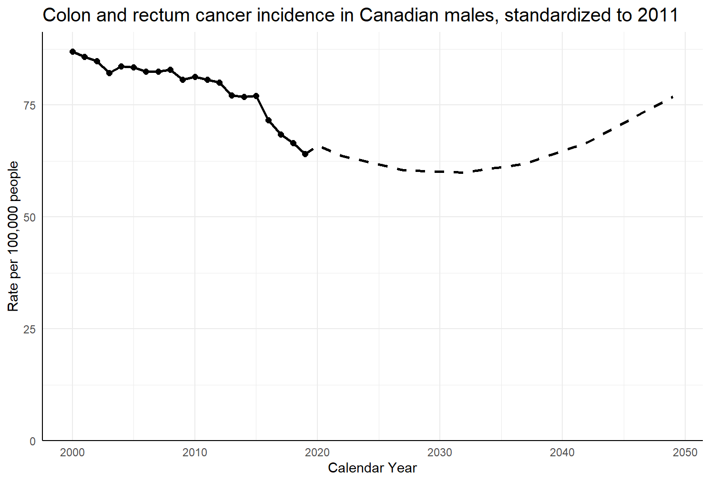
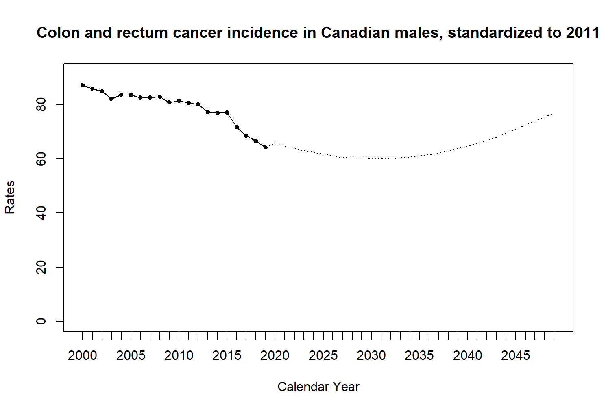

In 2013, an R-based tool, Canproj, was developed to streamline the process of model fitting and selection. Despite being widely used, Canproj is limited by its outdated development standards and aging dependencies. Canproj was refactored into this R package with an opinionated design, formal classes, testing suite, continuous integration, increased modularity, and improved documentation while preserving the original functionality.

Aside from internal modifications, the key changes in this package are the ability to use any number of age groups (where n \>= 2), and the introduction of S7 classes for standard populations.

## Cheat Sheet

As part of refactoring, some aspects of the visible functions and variables have changed. Below is a table highlighting these changes in brief.

| Original function or variable | Refactored function or variable | Notes |
|------------------------|------------------------|------------------------|
| canproj(cdat, pdat, startp) | canproj(cdat, pdat, startp, standpop) | Standard population is now a required input. |
|  | canproj_all_methods(cdat, pdat, start, standpop) | A function to run all Canproj methods. Inputs are identical to  canproj(), excluding 'methods'. |
| hybdproj(cdat, pdat, startp) | hybdproj(cdat, pdat, startp, standpop) | Standard population is now a required input. |
| method.estimate() | method_estimate() | Renamed to avoid class conflicts. |
| method.prediction() | method_predict() | Renamed to avoid class conflicts. |
| method.getpred() | method_get_predictions() | Renamed to avoid class conflicts. |
| method.getproj() | method_get_projections() | Renamed to avoid class conflicts. |
| ca11 | stdpop_Canada_2011 | Now an S7 object. |
|  | stdpop_Canada_2021 | Canadian standard population for 2021. |
| wdsd | stdpop_WHO_2000_2025 | Now an S7 object. |
|  | StandardPopulation(name, strata, weights) | S7 constructor for standard population objects. Used to make custom standard populations. |

: Differences in use between the two packages

## Colon and rectum cancer incidence in Canadian males

This example can be run with the refactored package as follows:

```{r, eval=FALSE}

library(canproj)
  
incidence <- canproj::colorectal_incidence_male
population <- canproj::canada_male_population
proj_cr_incidence_male <- canproj(
  incidence, 
  population, 
  2020, 
  stdpop_Canada_2011
  )

```

Given the same inputs, the equivalent command in the original package would be:

```{r, eval=FALSE}

source("canproj-v2019.R") 

proj_cr_incidence_male <- canproj(incidence, population, 2020)
```

The resulting annual projections are identical in this case, showing that the refactored package aligns with Canproj. For brevity, only projected rate and counts are displayed.

::::: {style="display: flex; gap: 20px;"}
::: {style="width: 45%;"}
```{r, echo = FALSE, results = 'asis', warning = F}
library(knitr)

# refactored
proj_refactored <- structure(c(65.932503, 64.798297, 63.66409, 63.014422, 62.364754, 
61.715086, 61.065418, 60.41575, 60.317378, 60.219006, 60.120634, 
60.022261, 59.923889, 60.334112, 60.744334, 61.154557, 61.564779, 
61.975001, 62.90532, 63.835638, 64.765956, 65.696275, 66.626593, 
68.088499, 69.550406, 71.012312, 72.474218, 73.936124, 75.398031, 
76.859937, 13253, 13332, 13421, 13637, 13866, 14036, 14123, 14191, 
14398, 14601, 14796, 14971, 15124, 15409, 15684, 15955, 16209, 
16444, 16814, 17186, 17563, 17932, 18292, 18798, 19311, 19835, 
20360, 20882, 21409, 21947), dim = c(30L, 2L), dimnames = list(
    c("2020", "2021", "2022", "2023", "2024", "2025", "2026", 
    "2027", "2028", "2029", "2030", "2031", "2032", "2033", "2034", 
    "2035", "2036", "2037", "2038", "2039", "2040", "2041", "2042", 
    "2043", "2044", "2045", "2046", "2047", "2048", "2049"), 
    c("asr", "case")))

knitr::kable(proj_refactored, caption = "Refactored Canproj")
```
:::

::: {style="width: 45%;"}
```{r, echo = FALSE, results = 'asis', warning = F}
library(knitr)

# original
proj_original <- structure(c(65.932503, 64.798297, 63.66409, 63.014422, 62.364754, 
61.715086, 61.065418, 60.41575, 60.317378, 60.219006, 60.120634, 
60.022261, 59.923889, 60.334112, 60.744334, 61.154557, 61.564779, 
61.975001, 62.90532, 63.835638, 64.765956, 65.696275, 66.626593, 
68.088499, 69.550406, 71.012312, 72.474218, 73.936124, 75.398031, 
76.859937, 13253, 13332, 13421, 13637, 13866, 14036, 14123, 14191, 
14398, 14601, 14796, 14971, 15124, 15409, 15684, 15955, 16209, 
16444, 16814, 17186, 17563, 17932, 18292, 18798, 19311, 19835, 
20360, 20882, 21409, 21947), dim = c(30L, 2L), dimnames = list(
    c("2020", "2021", "2022", "2023", "2024", "2025", "2026", 
    "2027", "2028", "2029", "2030", "2031", "2032", "2033", "2034", 
    "2035", "2036", "2037", "2038", "2039", "2040", "2041", "2042", 
    "2043", "2044", "2045", "2046", "2047", "2048", "2049"), 
    c("asr", "case")))

knitr::kable(proj_original, caption = "Canproj")

```
:::
:::::


```{r, fig.cap="Graph 1: Graph produced by refactored Canproj", out.width="70%", fig.align="center", echo=FALSE}

```


```{r, fig.cap="Graph 2: Graph produced by Canproj", out.width="70%", fig.align="center", echo=FALSE}



```


## Rare cancers and small populations

With sufficiently small case counts, Canproj will select the 5-year average model. During package development, a bug was found that impacts projection results with using both the `sum5 = T` and `sum5 = F` methods. The package would calculate rates based on past 6 years instead of 5, occasionally resulting in non-zero projections despite the most recent 5 years of observed data having zero cases.

This example will use the following simulated data.

```{r, eval=FALSE}

set.seed(83765)
incidence <- matrix(floor(abs(rnorm(285, 0.1, 0.5))), nrow = 19, ncol = 15)

set.seed(62743)
population <- matrix(floor(rnorm(380, 50000, 750)), nrow = 19, ncol = 20)

# Commands used to run Canproj:
canproj(incidence, population, 2025, stdpop_Canada_2011)
canproj(incidence, population, 2025)
```

The bug has been fixed in the refactored package, resulting in different projections across packages.

::::: {style="display: flex; gap: 20px;"}
::: {style="width: 45%;"}
```{r,  echo=FALSE}

#refactored
proj_refactored <- structure(c(0.409781, 0.122117, 0.30166, 0.129736, 0.106271, 
0.11079, 0.154606, 0.154606, 0.154606, 0.154606, 0.154606, 3, 
2, 3, 1, 1, 1, 2, 2, 2, 2, 2), dim = c(11L, 2L), dimnames = list(
    c("2019", "2020", "2021", "2022", "2023", "2024", "2025", 
    "2026", "2027", "2028", "2029"), c("asr", "case")))
knitr::kable(proj_refactored, caption = "Refactored Canproj")

```
:::

::: {style="width: 45%;"}
```{r, echo=FALSE}

# original
proj_original <- structure(c(0.409781, 0.122117, 0.301660, 0.129736, 0.106271, 0.110790, 0.196576, 0.196576, 0.196576, 0.196576, 0.196576, 
3, 2, 3, 1, 1, 1, 2, 2, 2, 2, 2), dim = c(11L, 2L), dimnames = list(2019:2029, c("asr", "case")))

knitr::kable(proj_original, caption = "Canproj")

```
:::
:::::

In this case, the refactored package produces slightly lower projections than the original Canproj. Refactored Canproj uses the most recent 5 observed years (2020-2024) to calculate averages, while Canproj projected inflated rates due to including 2019 during calculations.

## Male oral cancer incidence in Manitoba

Canproj occasionally projects extreme and absurd growth in cases. In such cases, the error is not caused by model selection but happens due to the way model fitting and projection are performed. The refactored package includes a simply sanity check to try and identify when the error occurs.

This is done by calculating two annual percent changes (APCs): one for all observed years, and one for all projected years. If the difference between APCs is greater than 10, a warning message is produced to alert the user.

This example uses male oral cancer in Manitoba. Canproj projections show a stark difference between observed and projected periods, where observed cases hover around 110 people per year, but projected cases reach into the 4000s. The difference in APCs is about 15%, triggering the console warning.

```{r, eval=FALSE}

library(canproj)
  
incidence <- canproj::oral_incidence_mb

population <- canproj::mb_male_population

weights <- c(
  stdpop_Canada_2011@weights[1:17], 
  stdpop_Canada_2011@weights[18] + stdpop_Canada_2011@weights[19])
standpop <- StandardPopulation(
  name = "18grp Canada 2011", 
  strata = as.character(1:18), 
  weights = weights)

proj_oral_incidence_mb <- canproj(incidence, population, 2013, standpop)

```

::::: {style="display: flex; gap: 20px;"}
::: {style="width: 45%;"}
```{r, echo=FALSE}

observed <- structure(c(38.9912, 42.492735, 40.342095, 31.08622, 49.680286, 
57.591963, 52.2465, 50.928825, 41.784824, 46.14897, 53.34537, 
38.590264, 28.59909, 26.180004, 34.63679, 35.101658, 23.921007, 
29.617662, 12.467776, 29.100583, 27.728925, 22.645661, 30.810302, 
45.215947, 35.35092, 38.118402, 43.375235, 22.472879, 44.42704, 
31.258674, 140, 125, 110, 75, 105, 115, 
105, 120, 80, 115, 80, 115, 75, 130, 110, 115, 100, 100, 75, 
140, 110, 80, 95, 125, 110, 105, 110, 85, 165, 120), dim = c(30L, 2L), dimnames = list(c("1983", "1984", "1985", 
"1986", "1987", "1988", "1989", "1990", "1991", "1992", "1993", 
"1994", "1995", "1996", "1997", "1998", "1999", "2000", "2001", 
"2002", "2003", "2004", "2005", "2006", "2007", "2008", "2009", 
"2010", "2011", "2012"), c("asr", "case")))

knitr::kable(observed, caption = "Observed incidence")

```
:::

::: {style="width: 45%;"}
```{r, echo=FALSE}
projected <- structure(c(32.513308, 29.956574, 27.391006, 27.919985, 31.4767, 42.193478, 60.635802, 76.946775, 100.11654, 132.165246, 168.520448, 202.540489, 228.372189, 234.523754, 252.073142, 291.15289, 109.226805, 
141.640005, 190.889956, 238.775242, 289.46234, 368.350465, 495.107521, 
578.073765, 687.430691, 729.670259, 150, 170, 
199, 240, 296, 371, 465, 583, 723, 888, 1072, 1285, 1523, 1780, 
2057, 2360, 2674, 2989, 3309, 3602, 3884, 4126, 4351, 4548, 4730, 
4896), dim = c(26L, 2L), dimnames = list(c("2013", "2014", "2015", "2016","2017", "2018", "2019", "2020", "2021", "2022", "2023", "2024", "2025", "2026", "2027", "2028", "2029", "2030", "2031", "2032", "2033", 
"2034", "2035", "2036", "2037", "2038"), c("asr", "case")))

knitr::kable(projected, caption = "Projected incidence")

```
:::
:::::
